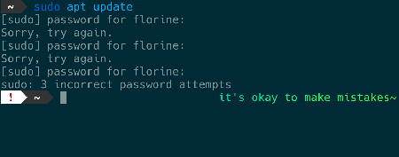
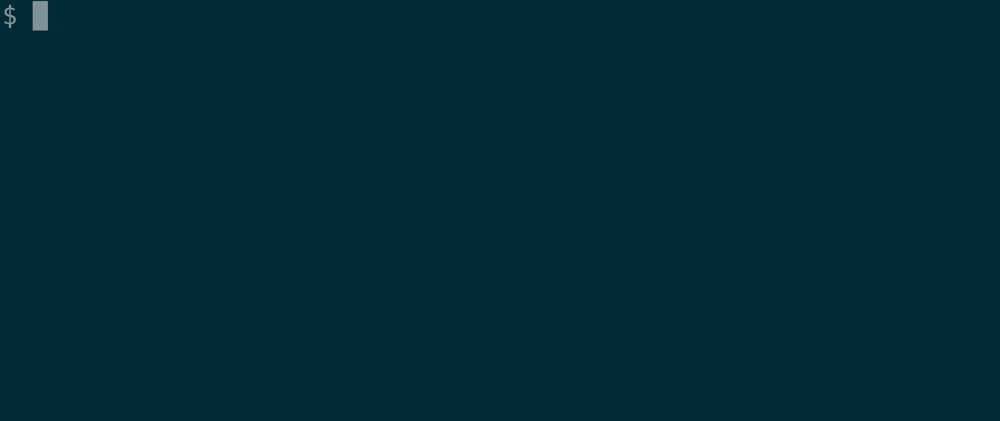
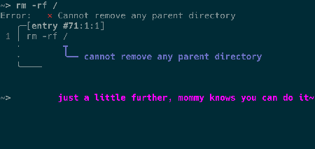
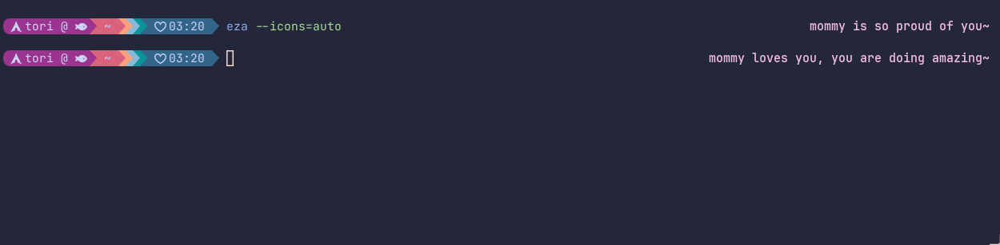
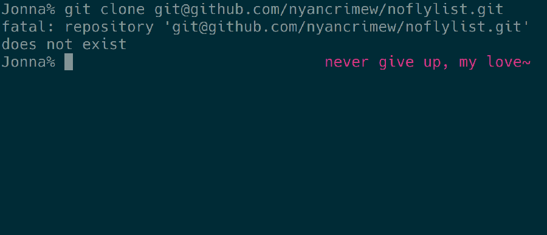

# mommy 💝
[](https://github.com/FWDekker/mommy/releases/latest)
[](https://aur.archlinux.org/packages/mommy/)
[](https://github.com/FWDekker/mommy/actions/workflows/ci.yml?query=branch%3Amain)
[](https://github.com/FWDekker/mommy/blob/main/LICENSE)

---

<a name="toc"></a>🚚&nbsp;[**installation**](#installation) | 📖&nbsp;[**usage**](#usage) | 🙋&nbsp;[**configuration**](#configuration) | 🐚&nbsp;[**shell integration**](#shell-integration) | ⚗️&nbsp;[**development**](#development) | 💖&nbsp;[**acknowledgements**](#acknowledgements)

---

mommy's here to support you!
mommy will compliment you if things go well, and will encourage you if things are not going
so well~

mommy is fully customizable, integrates with any shell, works on any system, and most importantly, loves you very
much~ ❤️




## 🚚 installation<a name="installation"></a> <small><sup>[top ▲](#toc)</sup></small>
mommy works on any system.
mommy is tested on ubuntu, debian, archlinux, fedora, nixpkgs, macos, freebsd, netbsd, openbsd, and windows~

_don't see your favourite distro or package manager listed?
need help?
otherwise not satisfied?
[please open an issue](https://github.com/FWDekker/mommy/issues)~_

### 👩‍💼 with a package manager
find your operating system and package manager for the right instructions~

<details>
<summary>alpine linux</summary>

* **homebrew** (automatic updates)  
  installs from the [mommy tap](https://github.com/FWDekker/homebrew-mommy).
  (requires [brew](https://brew.sh/).)
  ```shell
  brew tap fwdekker/mommy
  brew install mommy
  ```
  after installing, check the
  [brew documentation on how to enable shell completions](https://docs.brew.sh/Shell-Completion)~
* **apk (github release)** (manual updates)
  ```shell
  # download latest package from github release
  curl -s https://api.github.com/repos/FWDekker/mommy/releases/latest | grep "browser_download_url.*\.apk" | cut -d : -f 2,3 | tr -d \" | xargs curl -sLOJ
  # install package
  sudo apk add --allow-untrusted ./mommy-*.apk
  ```
</details>

<details>
<summary>arch linux</summary>

* **arch user repository** (automatic updates)  
  installs from the [arch user repository](https://aur.archlinux.org/packages/mommy), allowing for automatic updates.
  you should probably use [an aur helper](https://wiki.archlinux.org/title/AUR_helpers) to do this:
  ```shell
  # if you use yay
  yay -S mommy
  # if you use paru
  paru -S mommy
  # if you use aura
  aura -A mommy
  # and so on
  ```
* **homebrew** (automatic updates)  
  installs from the [mommy tap](https://github.com/FWDekker/homebrew-mommy).
  (requires [brew](https://brew.sh/).)
  ```shell
  brew tap fwdekker/mommy
  brew install mommy
  ```
  after installing, check the
  [brew documentation on how to enable shell completions](https://docs.brew.sh/Shell-Completion)~
* **pacman (github release)** (manual updates)
  ```shell
  # download latest package from github release
  curl -s https://api.github.com/repos/FWDekker/mommy/releases/latest | grep "browser_download_url.*\.pacman" | cut -d : -f 2,3 | tr -d \" | xargs curl -sLOJ
  # install package
  sudo pacman -U ./mommy-*.pacman
  ```
</details>

<details>
<summary>debian/ubuntu/apt-based</summary>


* **apt ≥2.2.4** (automatic updates)  
  this method requires apt v2.2.4 or newer.
  check your version of apt with `apt -v`~

  installs from the [mommy apt repository](https://github.com/FWDekker/apt-mommy).
  the repository supports all architectures and suites~

   ```shell
   sudo curl -fsSo /etc/apt/sources.list.d/mommy.sources \
     https://raw.githubusercontent.com/FWDekker/apt-mommy/main/deb/mommy.sources

   sudo apt update
   sudo apt install mommy
   ```
* **apt <2.2.4** (automatic updates)  
  this method works on all versions of apt~

  installs from the [mommy apt repository](https://github.com/FWDekker/apt-mommy).
  the repository supports all architectures and suites~

  [check this page for details on what this code does](https://stackoverflow.com/a/71384057/)~
  ```shell
  sudo mkdir -m 0755 -p /etc/apt/keyrings/

  curl -fsSL https://raw.githubusercontent.com/FWDekker/apt-mommy/main/deb/Release.key |
    sudo gpg --dearmor -o /etc/apt/keyrings/mommy.gpg

  echo "deb [signed-by=/etc/apt/keyrings/mommy.gpg] https://raw.githubusercontent.com/FWDekker/apt-mommy/main/deb/ ./" |
    sudo tee /etc/apt/sources.list.d/mommy.list > /dev/null

  sudo apt update
  sudo apt install mommy
  ```
* **homebrew** (automatic updates)  
  installs from the [mommy tap](https://github.com/FWDekker/homebrew-mommy).
  (requires [brew](https://brew.sh/).)
  ```shell
  brew tap fwdekker/mommy
  brew install mommy
  ```
  after installing, check the
  [brew documentation on how to enable shell completions](https://docs.brew.sh/Shell-Completion)~
* **apt (github release)** (manual updates)
  ```shell
  # download latest package from github release
  curl -s https://api.github.com/repos/FWDekker/mommy/releases/latest | grep "browser_download_url.*\.deb" | cut -d : -f 2,3 | tr -d \" | xargs curl -sLOJ
  # install package
  sudo apt install ./mommy*.deb
  ```
</details>

<details>
<summary>freebsd</summary>

* **pkg (github release)** (manual updates)
  ```shell
  # download latest package from github release
  curl -s https://api.github.com/repos/FWDekker/mommy/releases/latest | grep "browser_download_url.*\.freebsd" | cut -d : -f 2,3 | tr -d \" | xargs curl -sLOJ
  # install package
  sudo pkg add ./mommy-*.freebsd
  ```
</details>

<details>
<summary>macos</summary>

* **homebrew** (automatic updates)  
  installs from the [mommy tap](https://github.com/FWDekker/homebrew-mommy).
  (requires [brew](https://brew.sh/).)
  ```shell
  brew tap fwdekker/mommy
  brew install mommy
  ```
  after installing, check the
  [brew documentation on how to enable shell completions](https://docs.brew.sh/Shell-Completion)~

  if you installed the [fish shell](https://fishshell.com/) from outside [brew](https://brew.sh/), you must add the following to your `~/.config/fish/config.fish` to enable shell completions for mommy:
  ```shell
  if test -d (brew --prefix)"/share/fish/completions"
      set -p fish_complete_path (brew --prefix)"/share/fish/completions"
  end
  ```
* **pkg (github release)** (manual updates)
  ```shell
  # download latest package from github release
  curl -s https://api.github.com/repos/FWDekker/mommy/releases/latest | grep "browser_download_url.*osx\.pkg" | cut -d : -f 2,3 | tr -d \" | xargs curl -sLOJ
  # install package
  sudo installer -pkg ./mommy*+osx.pkg -target /
  ```

  if you installed the [fish shell](https://fishshell.com/) using [brew](https://brew.sh/), you must add the following to your `~/.config/fish/config.fish` to enable shell completions for mommy:
  ```shell
  if test -d /usr/local/share/fish/vendor_completions.d/
      set -p fish_complete_path /usr/local/share/fish/vendor_completions.d/
  end
  ```
</details>

<details>
<summary>netbsd</summary>

* **pkg_add (github release)** (manual updates)
  ```shell
  # download latest package from github release
  curl -s https://api.github.com/repos/FWDekker/mommy/releases/latest | grep "browser_download_url.*netbsd\.tgz" | cut -d : -f 2,3 | tr -d \" | xargs curl -sLOJ
  # install package
  sudo pkg_add ./mommy-*+netbsd.tgz
  ```
</details>

<details>
<summary>nixpkgs/nixos</summary>

* **nix-shell** (temporary)  
  if you're curious but not ready for commitments, use `nix-shell` to temporarily install mommy:
  ```shell
  nix-shell -p mommy
  ```
* **home-manager** (persistent)  
  if you use home manager, install mommy by adding the following to your home manager configuration:
  ```nix
  home.packages = with pkgs; [
    mommy
  ];
  ```
  you can configure mommy as follows:
  ```nix
  home.packages = with pkgs; [
    (mommy.override {
      mommySettings = {
        sweetie = "catgirl";
      }
    })
  ];
  ```
  check [the full list of configuration options](#configuration).
  note that your nix configuration should use lowercase variable names~
* **nixos** (persistent)  
  install mommy by adding the following to your nixos configuration (usually in `/etc/nixos/configuration.nix`):
  ```nix
  environment.systemPackages = with pkgs; [
    mommy
  ];
  ```

  you can configure mommy as follows:
  ```nix
  environment.systemPackages = with pkgs; [
    (mommy.override {
      mommySettings = {
        sweetie = "catgirl";
      }
    })
  ];
  ```
  check [the full list of configuration options](#configuration).
  note that your nix configuration should use lowercase variable names~
</details>

<details>
<summary>openbsd</summary>

* **pkg_add (github release)** (manual updates)
  ```shell
  # download latest package from github release
  curl -s https://api.github.com/repos/FWDekker/mommy/releases/latest | grep "browser_download_url.*openbsd\.tgz" | cut -d : -f 2,3 | tr -d \" | xargs curl -sLOJ
  # install package
  sudo pkg_add -D unsigned ./mommy-*+openbsd.tgz
  ```
</details>

<details>
<summary>red hat/fedora/opensuse/rpm-based</summary>

* **dnf/yum (copr)** (automatic updates)  
  installs from the [copr repository](https://copr.fedorainfracloud.org/coprs/fwdekker/mommy/).
  (requires the `dnf-plugins-core` package.)
  ```shell
  sudo dnf copr enable fwdekker/mommy
  sudo dnf install mommy
  ```
  packages are signed by `fwdekker#mommy@copr.fedorahosted.org`, check for fingerprint
  `E332 C8E6 ADAA 58E4 1974 7CE2 CE16 3CFF 9F79 DD8A`~
* **homebrew** (automatic updates)  
  installs from the [mommy tap](https://github.com/FWDekker/homebrew-mommy).
  (requires [brew](https://brew.sh/).)
  ```shell
  brew tap fwdekker/mommy
  brew install mommy
  ```
  after installing, check the
  [brew documentation on how to enable shell completions](https://docs.brew.sh/Shell-Completion)~
* **dnf (github release)** (manual updates)
  ```shell
  # download latest package from github release
  curl -s https://api.github.com/repos/FWDekker/mommy/releases/latest | grep "browser_download_url.*\.rpm" | cut -d : -f 2,3 | tr -d \" | xargs curl -sLOJ
  # install package
  sudo dnf install ./mommy-*.rpm
  ```
</details>

<details>
<summary>windows</summary>

for **git bash** or **cygwin**, see 
[the instructions for using mommy without a package manager](#-without-a-package-manager)~

* **wsl** (automatic or manual updates)  
  follow any of the mommy installation instructions for your installed linux subsystem (default is ubuntu) or
  [build mommy from source](#-without-a-package-manager)~
* **msys2** (automatic or manual updates)  
  follow any of the mommy installation instructions for _arch linux_ (except **do not use the arch user repository
  method**) or [build mommy from source](#-without-a-package-manager)~
</details>

### 🐐 without a package manager
<details>
<summary>build from source and install</summary>

if you want to customise where and how mommy installs, you can just compile her code yourself~

1. **prerequisites**
    * [git](https://git-scm.com/)
    * [gnu make](https://www.gnu.org/software/make/) (`gmake`)
2. **clone repository**
   ```shell
   git clone https://github.com/FWDekker/mommy.git
   cd mommy
   ```
3. **install**  
   this step builds mommy's files and copies them into your system.
   the exact paths differ per system, so find the instructions that are right for your system.

   > **ℹ️ note**  
   > if you want to install mommy only for the current user, add `prefix='~/.local/'` before `install`~

   > **💡 tip**  
   > check the [makefile](https://github.com/FWDekker/mommy/blob/main/GNUmakefile) for a list of all prefix variables
   > you can override~

    * _debian/ubuntu/apt-based_
      ```shell
      sudo make install/deb
      ```
    * _freebsd_
      ```shell
      sudo gmake install/freebsd
      ```
    * _macos_
      ```shell
      sudo gmake install/osxpkg
      ```
    * _netbsd_
      ```shell
      sudo gmake install/netbsd
      ```
    * _openbsd_
      ```shell
      sudo gmake install/openbsd
      ```
    * _windows_
      ```shell
      sudo make install
      ```
    * _all other unix systems_
      ```shell
      sudo make install
      ```
4. **test** (optional)  
   if you want to make sure installation was successful, you can run tests using
   [shellspec](https://github.com/shellspec/shellspec).
   run the following from inside the cloned mommy repository
   ```shell
   git clone https://github.com/shellspec/shellspec.git
   PATH="$(pwd)/shellspec/:$PATH" make system=1 test
   ```
   some tests will be skipped, depending on which other programs you have installed~
5. **uninstall** (optional)  
   if you want to uninstall after running `make install`, just run the same command as in step 3, except you replace
   `install` with `uninstall`.

   uninstall might not work completely if you installed a different version than the one you're uninstalling.
   for the best results, run `mommy -v`, check the version number, run `git checkout <the version>`, and then perform
   the uninstallation~
</details>

<details>
<summary>use without installing</summary>

if you don't want to use a package manager but also don't want to bother with `make`ing mommy, you can download a
universal build of mommy, and play around with that.
this will not install any files onto your system.
if you're here because you want to install mommy only for a specific user, the "build from source and install" option
is probably a better approach, though~

the script below downloads the latest stable release and extracts it for you.
if you don't want to use curl, just [check the latest release](https://github.com/FWDekker/mommy/releases/latest) in
your browser and download the file ending in `+generic.tar.gz` manually~

```shell
# download latest archive from github release
curl -s https://api.github.com/repos/FWDekker/mommy/releases/latest | grep "browser_download_url.*generic\.tar\.gz" | cut -d : -f 2,3 | tr -d \" | xargs curl -sLOJ
# extract archive to `mommy`
tar -C ./ -xzf mommy-*.tar.gz
# invoke mommy
./mommy/usr/bin/mommy
```
</details>

### 🔮 what's next?
check out [how to use mommy](#usage), read all about [ways you can configure mommy](#configuration), and
[integrate mommy with your shell](#shell-integration)~




## 📖 usage<a name="usage"></a> <small><sup>[top ▲](#toc)</sup></small>
mommy processes (the output status of) a command and compliments you if the command succeeds and encourages you if it
fails~

> [!TIP]
> the **recommended** way of long-term mommy usage is to [integrate mommy into your shell](#shell-integration), so
> mommy will run after every command you run~

### 💃 how to run<a name="how-to-run"></a>
for reference, here's the three main ways to invoke mommy~

| format                | example                     | when to use                                                          |
|-----------------------|-----------------------------|----------------------------------------------------------------------|
| `mommy [command] ...` | `mommy npm test`            | if you want mommy to respond to a single command~                    |
| `mommy -e [command]`  | `mommy -e "ls -l \| wc -l"` | if you want mommy when using `\|` or `>`, or need mommy in a script~ |
| `mommy -s [status]`   | `mommy -s $?`               | if you already ran a command and want mommy's help afterwards~       |

### 🛸 extra options<a name="extra-options"></a>
additionally, mommy knows a few extra options, which you can use to discover who mommy is and to tell mommy which
[configuration files](#configuration) she should use~

| short option | long option                   | description                                                                                       |
|--------------|-------------------------------|---------------------------------------------------------------------------------------------------|
| `-h`         | `--help`                      | opens mommy's manual page~                                                                        |
| `-v`         | `--version`                   | displays mommy's version information~                                                             |
| `-1`         |                               | writes output to stdout instead of stderr~                                                        |
| `-c <file>`  | `--config=<file>`             | tells mommy that she should read your [config](#configuration) from `<file>`~                     |
| `-d <dirs>`  | `--global-config-dirs=<dirs>` | sets [global configuration dirs](#config-file-locations) to the colon-separated list in `<dirs>`~ |
|              | `--rename=<name>`             | changes mommy executable name                                                                     |
|              | `--remove-rename=<name>`      | removes a previous rename and its symlinks                                                        |


## 🙋 configuration<a name="configuration"></a> <small><sup>[top ▲](#toc)</sup></small>
mommy's behavior can be modified using config files.
the easiest way to do so is to add your config to the file `~/.config/mommy/config.sh`.
you can also set up a global config file that is applied to all users, by default in `/etc/mommy/config.sh`.
[read more about the way config files are loaded](#config-file-locations)~

mommy supports [a lot of different settings](#list-of-all-settings).
if you want to configure the value of `MOMMY_SWEETIE`, add the following line to your config file:
```shell
MOMMY_SWEETIE="catgirl"
```
make sure you _do not_ put spaces around the `=`, and you _do_ put quotes (`"`) around the value~

<details>
<summary><a name="config-file-locations"></a>🔍 config file locations</summary>

when mommy runs, she will first load the system-wide **global** config file.
after that, she will read the user-specific **local** config file, overriding the values from the global file~

* to find the **global** config file, mommy runs the following procedure.
    1. mommy determines the list of global config dirs.
        1. if a list is specified using a [command-line option](#usage), that list is used.
        2. otherwise, the list consists of all directories in `$XDG_CONFIG_DIRS`, plus `/etc/mommy`, plus
         `/usr/local/etc/mommy/`.
    2. mommy traverses this list, and stops once she finds a directory that contains the file `config.sh`.
       this file will be the global config file~
* to find the **local** config file, mommy runs the following procedure.
    1. if a config file is specified using a [command-line option](#usage), that file is used. 
    2. if `$XDG_CONFIG_HOME` is defined, the file `$XDG_CONFIG_HOME/mommy/config.sh` is used.
    3. otherwise, `$HOME/.config/mommy/config.sh` is used~
</details>

<details>
<summary><a name="list-of-all-settings"></a>👛 list of all settings</summary>

| variable                       | description                                                                                                                                                                                                                                                                                                                                                                                                                                                                                                                                                                                                                                                                                    | [list](#how-to-configure-lists)? | default                    |
|--------------------------------|------------------------------------------------------------------------------------------------------------------------------------------------------------------------------------------------------------------------------------------------------------------------------------------------------------------------------------------------------------------------------------------------------------------------------------------------------------------------------------------------------------------------------------------------------------------------------------------------------------------------------------------------------------------------------------------------|----------------------------------|----------------------------|
| `MOMMY_CAREGIVER`              | what mommy calls herself                                                                                                                                                                                                                                                                                                                                                                                                                                                                                                                                                                                                                                                                       | yes                              | `mommy`                    |
| `MOMMY_PRONOUNS`               | mommy's pronouns for herself. should be five words separated by spaces, as in `they them their theirs themself` (subject, object, dependent possessive, independent possessive, reflexive). to use a literal whitespace inside a single pronoun, write `%%_%%`, as in `ye you%%_%%all y'all's yeers yeerselves`. in general, since the last two of the five words (`theirs` and `themself`) are relatively rare, you can also just give the first three words, and then the fourth and fifth words are auto-completed. so `they them their` is the same as `they them their theirs themself`. however, this will also result in `he him his` becoming `he him his hiss himself`, so be careful | yes                              | `she her her hers herself` |
| `MOMMY_SWEETIE`                | what mommy calls you                                                                                                                                                                                                                                                                                                                                                                                                                                                                                                                                                                                                                                                                           | yes                              | &lt;username>              |
| `MOMMY_PREFIX`                 | what mommy puts at the start of each sentence                                                                                                                                                                                                                                                                                                                                                                                                                                                                                                                                                                                                                                                  | yes                              | &lt;empty>                 |
| `MOMMY_SUFFIX`                 | what mommy puts at the end of each sentence                                                                                                                                                                                                                                                                                                                                                                                                                                                                                                                                                                                                                                                    | yes                              | `~`                        |
| `MOMMY_CAPITALIZE`             | `0` to start sentences in lowercase, `1` for uppercase, anything else to change nothing                                                                                                                                                                                                                                                                                                                                                                                                                                                                                                                                                                                                        | no                               | `0`                        |
| `MOMMY_COLOR`                  | color of mommy's text. you can use any [xterm color code](https://upload.wikimedia.org/wikipedia/commons/1/15/Xterm_256color_chart.svg), or write `lolcat` to use [lolcat](https://github.com/busyloop/lolcat) (install separately). specify multiple colors separated by `/` to randomly select one. set to empty string for your terminal's default color                                                                                                                                                                                                                                                                                                                                    | yes                              | `005`                      |
| `MOMMY_COMPLIMENTS`            | default compliment [templates](#how-to-configure-templates)                                                                                                                                                                                                                                                                                                                                                                                                                                                                                                                                                                                                                                    | yes                              | &lt;various>               |
| `MOMMY_COMPLIMENTS_EXTRA`      | additional compliment templates you can specify                                                                                                                                                                                                                                                                                                                                                                                                                                                                                                                                                                                                                                                | yes                              | &lt;empty>                 |
| `MOMMY_COMPLIMENTS_ENABLED`    | `1` to enable compliments, anything else to disable                                                                                                                                                                                                                                                                                                                                                                                                                                                                                                                                                                                                                                            | no                               | `1`                        |
| `MOMMY_ENCOURAGEMENTS`         | default encouragement [templates](#how-to-configure-templates)                                                                                                                                                                                                                                                                                                                                                                                                                                                                                                                                                                                                                                 | yes                              | &lt;various>               |
| `MOMMY_ENCOURAGEMENTS_EXTRA`   | additional encouragement templates you can specify                                                                                                                                                                                                                                                                                                                                                                                                                                                                                                                                                                                                                                             | yes                              | &lt;empty>                 |
| `MOMMY_ENCOURAGEMENTS_ENABLED` | `1` to enable encouragements, anything else to disable                                                                                                                                                                                                                                                                                                                                                                                                                                                                                                                                                                                                                                         | no                               | `1`                        |
| `MOMMY_FORBIDDEN_WORDS`        | mommy will never give outputs that match forbidden strings. each entry is expressed as an [extended regex](https://pubs.opengroup.org/onlinepubs/009695399/basedefs/xbd_chap09.html#tag_09_04) (see also `man grep`). to enforce this, mommy will filter out all templates that match at least one regex. as a failsafe, mommy will also check her final output after choosing and [filling in the template](#how-to-configure-templates), and will output nothing if she finds a forbidden string. also, if you want, you can replace literal characters with their octal (_not hex!_) escape sequences; for example, you can write `\0155\0157\0155` instead of `mom`                        | yes                              | &lt;empty>                 |
| `MOMMY_IGNORED_STATUSES`       | exit codes that mommy should never reply to. set to empty string to ignore nothing                                                                                                                                                                                                                                                                                                                                                                                                                                                                                                                                                                                                             | yes                              | `130`                      |
</details>

<details>
<summary><a name="how-to-configure-lists"></a>🪣 how to configure lists</summary>

some of these settings support lists.
mommy chooses a random element from each list each time she is called by you.
(except for `MOMMY_FORBIDDEN_WORDS` and `MOMMY_IGNORED_STATUSES`, where mommy always considers all elements of the
list.)
in a list, elements are separated by a newline or by a `/`.
to use a literal newline or slash, write `%%N%%` or `%%S%%`, respectively.
elements that contain whitespace only, and elements that start with a `#` are ignored~

* for example, if you set
  ```shell
  MOMMY_SWEETIE="girl/kitten"
  ```
  then mommy will sometimes call you `girl`, and sometimes `kitten`~
* if you set
  ```shell
  MOMMY_CAREGIVER="mommy
  mummy/#daddy/care%%S%%giver"
  ```
  then mommy will call herself `mommy`, `mummy`, or `care/giver`, but not `daddy`~
* if you set
  ```shell
  MOMMY_PRONOUNS="she her her hers herself/they them their theirs themself"
  ```
  then mommy may choose between `mommy knows she loves her girl` and `mommy knows they love their girl` (but not
  `mommy knows they love her girl`)~
* if you set
  ```shell
  MOMMY_FORBIDDEN_WORDS="cat/dog"
  ```
  then mommy will never use templates that contain `cat`, and will never use templates that contain `dog`~
</details>

<details>
<summary><a name="how-to-configure-templates"></a>🧬 how to configure templates</summary>

you can add a [list](#how-to-configure-lists) of your own compliments to either `MOMMY_COMPLIMENTS` or
`MOMMY_COMPLIMENTS_EXTRA`.
there is a slight difference between the two lists:

* if you want both the default _and_ your own compliments, add your own compliments to `MOMMY_COMPLIMENTS_EXTRA`~
* if you want your own compliments and _not_ the default compliments, add your own compliments to `MOMMY_COMPLIMENTS`~

and similarly so for encouragements~

inside compliments and encouragements, you can put placeholders that contain the random values that mommy chose.
for example, if you add the compliment `%%CAREGIVER%% loves you`, and have `MOMMY_CAREGIVER=your mommy`, then mommy
outputs `your mommy loves you`~

| variable        | description                                      | note                               |
|-----------------|--------------------------------------------------|------------------------------------|
| `%%CAREGIVER%%` | what mommy calls herself                         |                                    |
| `%%THEY%%`      | mommy's subject pronoun (e.g. they, she, he)     |                                    |
| `%%THEM%%`      | mommy's object pronoun (e.g. them, her, he)      |                                    |
| `%%THEIR%%`     | mommy's possessive pronoun (e.g. their, her, he) |                                    |
| `%%SWEETIE%%`   | what mommy calls you                             |                                    |
| `%%N%%`         | a newline                                        | can be used inside other variables |
| `%%S%%`         | a forward slash (`/`)                            | can be used inside other variables |
| `%%_%%`         | a whitespace                                     | can be used inside other variables |
</details>


## 🐚 shell integration<a name="shell-integration"></a> <small><sup>[top ▲](#toc)</sup></small>
instead of calling mommy for each command, you can fully integrate mommy with your shell to get mommy's output each time
you run any command.
here are some examples on how you can do that in various shells.
recall that you can add `MOMMY_COMPLIMENTS_ENABLED=0` to your mommy config file to disable compliments while keeping
encouragements~

_this is just a small list of possibilities.
if you know of another way to integrate mommy, feel free to contribute them by opening a pull request!_

<details>
<summary>🪅 bash</summary>

in bash you can set
[`PROMPT_COMMAND`](https://www.gnu.org/savannah-checkouts/gnu/bash/manual/bash.html#index-PROMPT_005fCOMMAND) to run
mommy after each command.
just add the following line to `~/.bashrc`:
```shell
PROMPT_COMMAND="mommy -1 -s \$?; $PROMPT_COMMAND"
```


</details>

<details>
<summary>🐟 fish</summary>

in fish you can have mommy output a message on the right side of your prompt by creating
`~/.config/fish/functions/fish_right_prompt.fish` with the following contents:
```shell
function fish_right_prompt
    mommy -1 -s $status
end
```
if you have an [oh my fish](https://github.com/oh-my-fish/oh-my-fish) theme installed, check the docs of your theme to
see if there's an easy way to extend the theme's right prompt.
if not, you can either overwrite it with the above code, or copy-paste the theme's code into your own config file and
then add mommy yourself~


</details>

<details>
<summary>📈 nushell</summary>

in nushell you can have mommy output a message on the right side of your prompt by adding the following line to your
`~/.config/nushell/config.nu` file:
```shell
$env.PROMPT_COMMAND_RIGHT = {|| mommy -1 -s $env.LAST_EXIT_CODE }
```


</details>

<details>
<summary>🪟 powershell</summary>

the exact instructions depend on [how and where you installed mommy](#installation)~

1. **disable mommy's color output**  
   mommy's colors don't really work well in powershell, so you'll have to disable them~
   * **wsl**  
     if you want to run mommy through wsl, open `wsl` and run
     ```shell
     # run this in wsl
     mkdir -p ~/.config/mommy
     echo "MOMMY_COLOR=" >> ~/.config/mommy/config.sh
     ```
   * **git bash**  
     if you want to run mommy through git bash, run
     ```shell
     # run this in powershell
     [IO.Directory]::CreateDirectory("$HOME/.config/mommy")
     [IO.File]::WriteAllLines("$HOME/.config/mommy/config.sh", "MOMMY_COLOR=''")
     ```
2. **test prompt**  
   change powershell's prompt to include mommy's message~
   * **wsl**  
     if you want to run mommy through wsl, run
     ```shell
     # run this in powershell
     function prompt { "$(wsl -e mommy -1 -s $([int][bool]::Parse(!$?)))> " }
     ```
   * **git bash**  
     if you want to run mommy through git bash, and you downloaded mommy to `C:\Users\username\mommy`, run
     ```shell
     # run this in powershell
     function prompt { "$(& "C:\Program Files\Git\bin\sh.exe" "C:/Users/username/mommy" -1 -s $([int][bool]::Parse(!$?)))> " }
     ```
3. **save prompt**  
   now let's make this prompt persistent.
   in powershell, run `notepad $profile` to open your powershell settings, and add the `function prompt [...]` line from
   above~

   > **ℹ️ note**  
   > if you get an error that this file does not exist, run `new-item -itemtype file -path $profile -force` to create
   > it~

   > **ℹ️ note**  
   > if you get an error that you cannot run local scripts, run 
   > `Set-ExecutionPolicy -ExecutionPolicy RemoteSigned -Scope LocalMachine` as admin, or 
   > [sign the script](https://learn.microsoft.com/en-us/powershell/module/microsoft.powershell.core/about/about_signing?view=powershell-7.3#methods-of-signing-scripts)~
4. **improve prompt**  
   the instructions above show the basics of using mommy in powershell.
   you can make it way cooler using a theme engine like [oh-my-posh](https://ohmyposh.dev/).
   for example, you can use background colors or display mommy in the right prompt instead of the left~

</details>

<details>
<summary>🚀 starship</summary>

to configure `oh-my-posh`-like prompts (like `bash`, `fish`, and `zsh`), first create a custom `mommy` module in your `.config/starship.toml` file:
```toml
[custom.mommy]
command = "mommy -1 -s $status"
when = "true"
```
you can place this anywhere in your starship arrangements.
the above code is the mommy command from fish, but you can replace it with any of the mommy commands listed for another shell~

for example, add the following to your starship config to have mommy appear on your right prompt at all times~
```toml
right_format = "$custom"
```


</details>

<details>
<summary>💤 zsh</summary>

depending on where you want mommy's output, the instructions are a bit different.
you can either get the output above your prompt, or aligned to the right~

**above the prompt**  
to get mommy's output on a separate line above your prompt, add the following line to `~/.zshrc`:
```shell
precmd() { mommy -1 -s $? }
```

**to the right of each command**  
to get mommy's output on the same line as your prompt, aligned to the right, add the following to `~/.zshrc`:
```shell
set -o PROMPT_SUBST
RPS1='$(mommy -1 -s $?)'  # using single quotes here is required!
```
and add the following to your mommy config:
```shell
MOMMY_COLOR=""
MOMMY_PREFIX="%F{005}/%F{006}"
MOMMY_SUFFIX="~%f"
```

normally, mommy sets colors using standard ansi color codes, but zsh's support is a bit special, resulting in zsh
miscalculating the prompt width, which looks like your prompt is misaligned or shifted.
to fix this, you should disable mommy's color feature and manually set colors in the prefix option.
to specify colors, use zsh's special syntax, where the numbers correspond to the
[xterm color codes](https://upload.wikimedia.org/wikipedia/commons/1/15/Xterm_256color_chart.svg). 
finally, the `%f` in the suffix resets the colors~


</details>

<details>
<summary>🐌 other shells</summary>

as a generic method, in any posix shell (including `sh`, `ash`, `dash`, `bash`) you can change the prompt itself to
contain a message from mommy by setting the `$PS1` variable:
```shell
PS1="\$(mommy -1 -s \$?)$PS1"
```
to improve the spacing, set `MOMMY_SUFFIX="~ "` in mommy's config file.

add the above line to the config file for your shell (e.g. `.bashrc` for `bash`) to apply it each time you open the
shell.
some shells (`dash`, `pdksh`) do not have a config file like `.bashrc`, but you can enable one by adding the following
line to `~/.profile`:
```shell
export ENV="$HOME/.shrc"
```
note that this will apply to all (non-login) posix shells that you open.
after that, add the above-mentioned line that defines `PS1` to `~/.shrc`.
log out and back in, and mommy will appear in your shell~
</details>

<details>
<summary><a name="renaming-the-mommy-executable"></a>✍️ renaming the mommy executable</summary>

if you use any of the above integrations, you don't have to call mommy directly.
if you don't want that, but also don't want to write `mommy`, this section explains how you can instead write, say,
`daddy`, `marija`, or `sinterklaas`~

mommy is installed in slightly different locations on different systems, but you can easily find where mommy is
installed with `whereis mommy`:
```shell
$ whereis mommy
mommy: /usr/bin/mommy /usr/share/man/man1/mommy.1.gz
```
the exact output of `whereis` differs depending on your system, but in this case you can see that the program is
installed in `/usr/bin/mommy` (and the manual page in `/usr/share/man/man1/mommy.1.gz`).
if `whereis mommy` doesn't work, mommy is not on your path, but you can still find her with `find / -name mommy`~

anyway, after finding mommy, you can just symlink using the following commands:
(if `whereis` gave different paths than the ones above, then change these commands accordingly)
```shell
sudo ln -fs /usr/bin/mommy /usr/bin/daddy
sudo ln -fs /usr/share/man/man1/mommy.1.gz /usr/share/man/man1/daddy.1.gz
```

> [!IMPORTANT]
> uninstalling mommy will not remove the manually created symlinks~
</details>


## ⚗️ development<a name="development"></a> <small><sup>[top ▲](#toc)</sup></small>
this section explains some development details of the project, like its file structure and how to build mommy from source, in case you want to [help with development](https://github.com/FWDekker/mommy/blob/main/CONTRIBUTING.md), for example~

<details>
<summary>🧱 file structure</summary>

| path                         | contains                                                                                                                                                          |
|------------------------------|-------------------------------------------------------------------------------------------------------------------------------------------------------------------|
| _project root_               | various configuration files and repository documentation                                                                                                          |
| `.github/`                   | supplemental files for the repository on github                                                                                                                   |
| `.github/img/`               | images used in the readme                                                                                                                                         | 
| `.github/workflows/`         | github actions definitions                                                                                                                                        |
| `pkg/`                       | files used by programs that package mommy into distributable files                                                                                                |
| `pkg/fpm/`                   | changelogs for packages created by `fpm`. more about these changelogs in the [development section in the readme](/?tab=readme-ov-file#%EF%B8%8F-development-top-) |
| `pkg/rpkg/`                  | files used by `rpkg`, which packages for `rpm`, known from red hat linux                                                                                          |
| `src/`                       | the source code. this is where the features live                                                                                                                  |
| `src/main/`                  | the source code files that should be distributed to users (after some pre-processing)                                                                             |
| `src/main/completions/`      | files that specify for various shells how auto-completion works for `mommy`                                                                                       |
| `src/main/man/`              | the documentation files that are distributed to users                                                                                                             |
| `src/main/sh/`               | the actual shell code that implements the `mommy` command                                                                                                         |
| `src/test/`                  | the code that tests the code in `src/main/` to see if everything works as desired                                                                                 |
| `src/test/helper/`           | files containing additional functions and variables, reusable across different test suites                                                                        |
| `src/test/resources/`        | files that can be placed inside the test environment while executing tests                                                                                        |
| `src/sh/`                    | the test code that runs mommy and checks that the outputs are as desired                                                                                          |
| `src/sh/integration_spec.sh` | tests for integration with an external environment or program                                                                                                     |
| `src/sh/unit_spec.sh`        | tests for mommy's core features, irrespective of the outside environment                                                                                          |

</details>

<details>
<summary>🎬 run</summary>

you can actually just directly run the script in `src/main/sh/mommy`.
the only difference will be that the `-h` and `-v` options may not work correctly.
if that annoys you, run `make build` after each change, and use `build/bin/mommy` instead~
</details>

<details>
<summary>🧪 tests</summary>

1. **requirements**  
   [shellspec](https://github.com/shellspec/shellspec)
2. **test local code**
   1. all tests
      ```shell
      make test
      ```
   2. unit tests
      ```shell
      make test/unit
      ```
   3. integration tests
      ```shell
      make test/integration
      ```
3. **test installed binary**
   ```shell
   make system=1 test
   ```
4. **configuration**  
   except for `system=1`, test behaviour is configured with environment variables.
   check the various files in [`src/test/`](https://github.com/FWDekker/mommy/tree/main/src/test) to find 'em all~
</details>

<details>
<summary>🏬 distribution</summary>

mommy is distributed in three ways:
* attached as **binary packages** to each github release,
* built on **build servers**,
* and available as **source builds** ("ports", basically) on a few servers.

let's go into them in more detail~

* **📦 binary packages**  
  the binary packages attached to the github release are built with the
  [makefile](https://github.com/FWDekker/mommy/blob/main/GNUmakefile).
  run `make list` to see a list of build targets;
  you're looking for the ones starting with `dist/`~

  to build the packages, you need at least gnu make, ruby, and [fpm](https://github.com/jordansissel/fpm).
  (actually, you don't need fpm for netbsd and openbsd.)
  on debian-based systems, you already have gnu make, so you only need
  ```shell
  sudo apt install ruby
  sudo gem install fpm
  ```

  after that, just run `make dist/deb` (or better: `mommy make dist/deb`), and a `.deb` package will be built in
  `dist/`.
  run `make` or `make list` for a list of valid build targets.
  a special target is `install`, which directly copies the files into the specified directories on your system.
  these directories can be changed by setting `prefix` variables, as in `make prefix=/usr/ install`.
  i recommend running `make --dry-run prefix=/usr/ install` first so you can verify that all directories are calculated
  correctly.
  check the [makefile](https://github.com/FWDekker/mommy/blob/main/GNUmakefile) for more details~

  all systems can build packages for themselves without additional dependencies beyond those noted above.
  if you want to compile for a different system than the one you're using, you may need additional dependencies.
  for example, if you want to build packages for alpine linux, archlinux, and rpm from a debian-like system, you will
  respectively need
  ```shell
  sudo apt install libarchive-tools rpm zstd
  ```
  and then you can run
  ```shell
  make dist/apk dist/pacman dist/rpm
  ```
  unfortunately, packages for macos, netbsd, and openbsd cannot be built on systems other than themselves~
* **🏗️ build servers**  
  build servers build mommy distributions on-demand for each release, and make the created packages available for all
  users.
  how sweet~

  * [apt-mommy](https://github.com/FWDekker/apt-mommy) is a github-based apt repository that hosts mommy's `.deb`
    packages after they have been built in
    [mommy's cd pipeline](https://github.com/FWDekker/mommy/actions/workflows/cd.yml)~
  * [copr](https://copr.fedorainfracloud.org/coprs/fwdekker/mommy/) builds packages for fedora and epel~
* **🌱 source builds**  
  some servers host instructions on how to build mommy, but don't do any work beyond that.
  users connect to the server, get the latest instructions, and their system builds mommy for them locally~

  * for **arch linux**, the [arch user repository](https://aur.archlinux.org/) hosts the
    [mommy package](https://aur.archlinux.org/packages/mommy).
    a development mirror is hosted on github in [aur-mommy](https://github.com/FWDekker/aur-mommy)~
  * for **homebrew**, mommy has the [homebrew-mommy](https://github.com/FWDekker/homebrew-mommy) repository on github,
    which is resolved automatically by the brew client based on the repository's name~
</details>

<details>
<summary>📯 release</summary>

[`main`](https://github.com/FWDekker/mommy/tree/main) contains the latest in-development version.
when the version in `main` is ready to be released, just use the
[deploy action](https://github.com/FWDekker/mommy/actions/workflows/cd.yml), which can be activated using a
`workflow_dispatch` event~

[`latest`](https://github.com/FWDekker/mommy/tree/latest) contains the most recently released version.
this version can be considered stable.
when a new version is deployed as described above, the `latest` branch is fast-forwarded automatically.
you should **not** update the `latest` branch manually!

<b>release checklists</b>

* **before triggering deployment**
  * update `version`~
  * update all changelogs~
    * update `CHANGELOG.md`~
      * do not leave a placeholder section for `[unreleased]`, because it will end up like that in the `.deb`'s
        `changelog.gz`~
      * remove empty subsections for the new release~
      * ensure no line breaks are used as whitespace;
        github release notes use them as actual line breaks~
    * update `pkg/rpkg/mommy.spec.rpkg` if changes were made to copr's rpkg packaging process~
    * update `pkg/fpm/deb.changelog` if changes were made to fpm's debian packaging process~
    * update `pkg/fpm/rpm.changelog` if changes were made to fpm's rpm packaging process~
  * update acknowledgements in `README.md`~
  * update promotional images in `.github/img/`~

* **after triggering deployment**
  * a new github release is created automatically~
  * the [`latest`](https://github.com/FWDekker/mommy/tree/latest) branch is pointed to the new release~
  * [aur-mommy](https://github.com/FWDekker/aur-mommy/)
    * updated automatically when `mommy` updates
    * always [manually check deployment status](https://github.com/FWDekker/aur-mommy/actions?query=branch%3Amaster)~
  * [copr](https://copr.fedorainfracloud.org/coprs/fwdekker/mommy/)
    * updated automatically when `mommy` updates
    * always [manually check deployment status](https://copr.fedorainfracloud.org/coprs/fwdekker/mommy/builds/)~
  * [apt-mommy](https://github.com/FWDekker/apt-mommy/)
      * updated automatically when `mommy` updates
      * always [manually check deployment status](https://github.com/FWDekker/apt-mommy/commits/main)~
  * [homebrew-mommy](https://github.com/FWDekker/homebrew-mommy)
    * updated automatically when `mommy` updates
    * always [manually check deployment status](https://github.com/FWDekker/homebrew-mommy/actions?query=branch%3Amain)~
</details>


## 💖 acknowledgements<a name="acknowledgements"></a> <small><sup>[top ▲](#toc)</sup></small>
mommy recognises _all_ contributors, no matter the size of the contribution.
if mommy should add, remove, or change anything here, [open an issue](https://github.com/FWDekker/mommy/issues/new) or
[contact the author](https://fwdekker.com/about/)~

* mommy thanks [aria beingessner](https://github.com/Gankra) for creating
  [cargo-mommy](https://github.com/Gankra/cargo-mommy), which inspired mommy to spawn herself into existence~
* mommy thanks [austin burk](https://github.com/sudofox) for creating
  [shell-mommy](https://github.com/sudofox/shell-mommy) and contributing to the mommy-sphere;
  mommy did not know about shell-mommy before embarking on her journey, but loves her very much~
* mommy thanks [natawie](https://github.com/natawie) for
  [suggesting publishing mommy on copr](https://github.com/FWDekker/mommy/issues/39) and
  [writing the zsh completions](https://github.com/FWDekker/mommy/pull/48)~
* mommy thanks [amber sprenkels](https://github.com/dsprenkels) for
  [reporting a bug](https://github.com/FWDekker/mommy/issues/45),
  [sharing great ideas](https://github.com/FWDekker/mommy/issues/46), and
  [making mommy talk less like a robot](https://github.com/FWDekker/mommy/pull/47)~
* mommy thanks [wei he](https://github.com/wei) for creating [socialify](https://github.com/wei/socialify),
  which mommy uses for her github social preview~
* mommy thanks [ckie](https://github.com/ckiee) for
  [bringing mommy to nixpkgs](https://github.com/NixOS/nixpkgs/pull/250034),
  [several neat improvements](https://github.com/FWDekker/mommy/pull/61), and for
  [maintaining the nixpkg](https://github.com/NixOS/nixpkgs/pull/274867)~
* mommy thanks [aemogie.](https://github.com/aemogie) for
  [telling her how to integrate with nushell](https://github.com/FWDekker/mommy/issues/65)~
* mommy thanks [maximilian downey twiss](https://github.com/Zopolis4) for
  [bumping mommy's actions to their latest versions](https://github.com/FWDekker/mommy/pull/68)~
* mommy thanks [fuel-pcbox](https://github.com/fuel-pcbox) for
  [her suggestion of supporting regexes for forbidden words](https://github.com/FWDekker/mommy/issues/103)~
* mommy thanks [satyam singh niranjan](https://github.com/Satanarious) for
  [suggesting powershell support](https://github.com/FWDekker/mommy/issues/124)~
* mommy thanks [biko](https://github.com/Bikoil) for
  [making mommy refer to people by their username by default](https://github.com/FWDekker/mommy/issues/131)~
* mommy thanks [toria](https://github.com/ninetailedtori) for
  [documenting how to configure starship](https://github.com/FWDekker/mommy/pull/135)~
