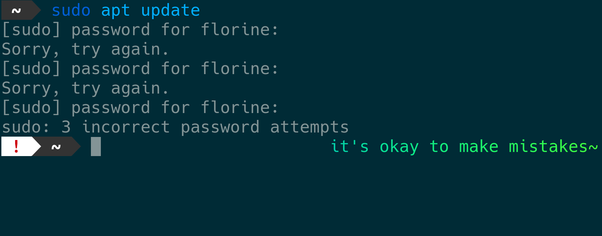
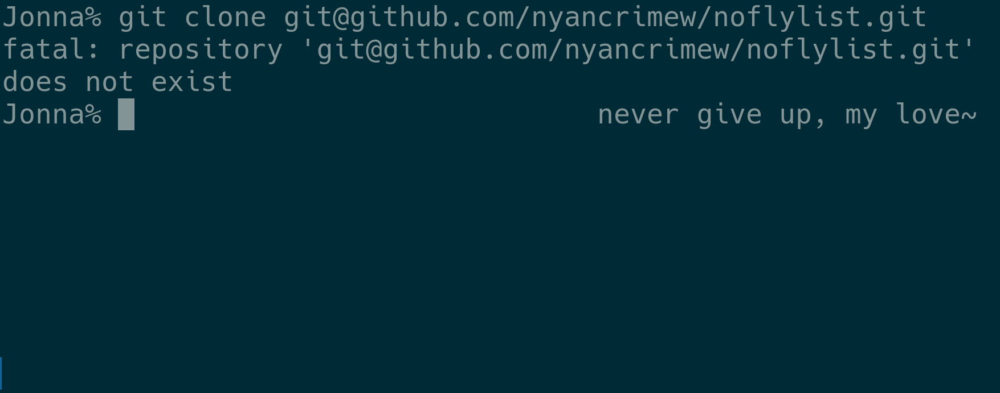

# mommy 💝
[](https://github.com/FWDekker/mommy/releases/latest)
[](https://aur.archlinux.org/packages/mommy/)
[](https://github.com/FWDekker/mommy/actions/workflows/ci.yml?query=branch%3Amain)
[](https://github.com/FWDekker/mommy/blob/main/LICENSE)

mommy's here to support you! mommy will compliment you if things go well, and will encourage you if things are not going
so well~

mommy is fully customizable, integrates with any shell, works on any unix system, and most importantly, loves you very
much~ ❤️


## installation 🚚
mommy works on any unix system.
mommy is tested on ubuntu, debian, macos, freebsd, netbsd, and openbsd~

### from a repository 🏤
_don't see your favorite package manager?
check the distribution archives below.
not satisfied?
[request support for your favorite installation method by opening an issue](https://github.com/FWDekker/mommy/issues)~_

<details>
<summary>arch linux</summary>

install on arch linux from the [aur mommy package](https://aur.archlinux.org/packages/mommy/), probably easiest with
[an aur helper](https://wiki.archlinux.org/title/AUR_helpers):

```shell
# if you use yay
yay -S mommy
# if you use paru
paru -S mommy
# if you use aura
aura -A mommy
# and so on
```
</details>

<details>
<summary>red hat/fedora/centos/etc</summary>

install on rpm-based distros from the [copr](https://copr.fedorainfracloud.org/coprs/fwdekker/mommy/) repository;
this requires that you have `dnf-plugins-core` installed:

```shell
dnf copr enable fwdekker/mommy
```
</details>

<details>
<summary>homebrew/linuxbrew</summary>

install with homebrew/linuxbrew from the [mommy tap](https://github.com/FWDekker/homebrew-mommy):

after installing, check the
[brew documentation on how to enable shell completions](https://docs.brew.sh/Shell-Completion)~

```shell
brew tap fwdekker/mommy
brew install mommy
```
</details>

### distribution archives 📦
[download the latest release](https://github.com/FWDekker/mommy/releases/latest) for your platform and install as usual:
* on debian/ubuntu/etc, run `sudo apt install ./mommy-*.deb`,
* on red hat/fedora/etc, run `sudo dnf install ./mommy-*.rpm`,
* on archlinux, run `sudo pacman -U ./mommy-*.pacman`,
* on alpine linux, run `sudo apk add --allow-untrusted ./mommy-*.apk`,
* on macos, run `sudo installer -pkg ./mommy*+osx.pkg -target /`,
* on freebsd, run `pkg add ./mommy-*.freebsd`,
* on netbsd, run `pkg_add ./mommy-*+netbsd.tgz`,
* on openbsd, run `pkg_add -D unsigned ./mommy-*+openbsd.tgz`,
* alternatively, on any unix system you can also download and extract the source code `.zip`, and copy
  `src/main/sh/mommy` into the appropriate directory
  (usually `/usr/bin/`)
  (and optionally also copy `src/main/man/man1/mommy.1` into `/usr/share/man/man1/`)

to update mommy, just repeat the installation process~

### what's next? 🔮
check out [how to use mommy](#usage-), read all about [ways you can configure mommy](#configuration-), and
[integrate mommy with your shell](#shell-integration-)~




## usage 📖
mommy integrates with your normal command-line usage and compliments you if the command succeeds and encourages you if
it fails~

```shell
$ mommy [-1] [-c config] [command] ...
# e.g. `mommy npm test`

$ mommy [-1] [-c config] -e eval
# e.g. `mommy -e "ls -l | wc -l"`

$ mommy [-1] [-c config] -s status
# e.g. `mommy -s $?`
```

by default, mommy outputs to stderr, but if you use `mommy -1 [other options]` she'll output to stdout~

use `mommy -v` to see which version of mommy you're using~


## configuration 🙋
mommy's behavior can be configured by defining variables in `~/.config/mommy/config.sh`.
or specify a different config file with `mommy -c ./my_config.sh [other options]`~

### config file format 🗃️
mommy executes the config file as a shell script and keeps the environment variables.
so, to change the value of `MOMMY_SWEETIE`, add the following line to your config file:
```shell
MOMMY_SWEETIE="catgirl"
```
make sure you do not put spaces around the `=`~

### available settings 👛
| variable                       | description                                                                                                                                                                                                                                                                                                                                                 | list? | default       |
|--------------------------------|-------------------------------------------------------------------------------------------------------------------------------------------------------------------------------------------------------------------------------------------------------------------------------------------------------------------------------------------------------------|-------|---------------|
| `MOMMY_CAREGIVER`              | what mommy calls herself                                                                                                                                                                                                                                                                                                                                    | yes   | `mommy`       |
| `MOMMY_PRONOUNS`               | mommy's pronouns for herself. should be three words separated by spaces, as in `they them their` (subject, object, possessive)                                                                                                                                                                                                                              | yes   | `she her her` |
| `MOMMY_SWEETIE`                | what mommy calls you                                                                                                                                                                                                                                                                                                                                        | yes   | `girl`        |
| `MOMMY_PREFIX`                 | what mommy puts at the start of each sentence                                                                                                                                                                                                                                                                                                               | yes   | &lt;empty>    |
| `MOMMY_SUFFIX`                 | what mommy puts at the end of each sentence                                                                                                                                                                                                                                                                                                                 | yes   | `~`           |
| `MOMMY_CAPITALIZE`             | `0` to start sentences in lowercase, `1` for uppercase, anything else to change nothing                                                                                                                                                                                                                                                                     | no    | `0`           |
| `MOMMY_COLOR`                  | color of mommy's text. you can use any [xterm color code](https://upload.wikimedia.org/wikipedia/commons/1/15/Xterm_256color_chart.svg), or write `lolcat` to use [lolcat](https://github.com/busyloop/lolcat) (install separately). specify multiple colors separated by `/` to randomly select one. set to empty string for your terminal's default color | yes   | `005`         |
| `MOMMY_COMPLIMENTS`            | default compliment templates                                                                                                                                                                                                                                                                                                                                | yes   | &lt;various>  |
| `MOMMY_COMPLIMENTS_EXTRA`      | additional compliment templates you can specify                                                                                                                                                                                                                                                                                                             | yes   | &lt;empty>    |
| `MOMMY_COMPLIMENTS_ENABLED`    | `1` to enable compliments, anything else to disable                                                                                                                                                                                                                                                                                                         | no    | `1`           |
| `MOMMY_ENCOURAGEMENTS`         | default encouragement templates                                                                                                                                                                                                                                                                                                                             | yes   | &lt;various>  |
| `MOMMY_ENCOURAGEMENTS_EXTRA`   | additional encouragement templates you can specify                                                                                                                                                                                                                                                                                                          | yes   | &lt;empty>    |
| `MOMMY_ENCOURAGEMENTS_ENABLED` | `1` to enable encouragements, anything else to disable                                                                                                                                                                                                                                                                                                      | no    | `1`           |
| `MOMMY_FORBIDDEN_WORDS`        | mommy will not use templates that contain forbidden / trigger words                                                                                                                                                                                                                                                                                         | yes   | &lt;empty>    |
| `MOMMY_IGNORED_STATUSES`       | exit codes that mommy should never reply to. set to empty string to ignore nothing                                                                                                                                                                                                                                                                          | yes   | `130`         |

### lists 🪣
some of these settings support lists.
mommy chooses a random element from each list each time she is called by you.
(except for `MOMMY_FORBIDDEN_WORDS` and `MOMMY_SUPPRESS_EXIT`, where all elements of the list are always considered.)
in a list, elements are separated by a newline or by a `/`.
elements that contain whitespace only, and elements that start with a `#` are ignored~

* for example, if you set
  ```shell
  MOMMY_SWEETIE="girl/kitten"
  ```
  then mommy will sometimes call you `girl`, and sometimes `kitten`~
* if you set
  ```shell
  MOMMY_CAREGIVER="mommy
  mummy/#daddy/caregiver"
  ```
  then mommy will call herself `mommy`, `mummy`, or `caregiver`, but not `daddy`~
* if you set
  ```shell
  MOMMY_PRONOUNS="she her her/they them their"
  ```
  then mommy may choose between `mommy knows she loves her girl` and `mommy knows they love their girl`~
* if you set
  ```shell
  MOMMY_FORBIDDEN_WORDS="cat/dog"
  ```
  then mommy will never use templates that contain `cat`, and will never use templates that contain `dog`~

### custom templates 🧬
you can add your own compliments to either `MOMMY_COMPLIMENTS` or `MOMMY_COMPLIMENTS_EXTRA`, but there is a slight
difference:
* if you want both the default _and_ your own compliments, add your own compliments to `MOMMY_COMPLIMENTS_EXTRA`, but
* if you want your own compliments and _not_ the default compliments, add your own compliments to `MOMMY_COMPLIMENTS`~

and similarly so for encouragements~

### template variables 📛
inside compliments and encouragements, you can put placeholders that contain the random values that mommy chose.
for example, if you add the compliment `%%CAREGIVER%% loves you`, and have `MOMMY_CAREGIVER=your mommy`, then mommy
outputs `your mommy loves you`~

| variable        | description                                       |
|-----------------|---------------------------------------------------|
| `%%CAREGIVER%%` | what mommy calls herself                          |
| `%%THEY%%`      | mommy's subject pronoun (e.g. he, she, they)      |
| `%%THEM%%`      | mommy's object pronoun (e.g. him, her, them)      |
| `%%THEIR%%`     | mommy's possessive pronoun (e.g. his, her, their) |
| `%%SWEETIE%%`   | what mommy calls you                              |

### renaming the mommy executable ✍️
if you want to write `daddy npm test` instead of `mommy npm test`, you can just create a symlink.
mommy is installed in slightly different locations on different systems, but you can easily find where mommy is
installed with `whereis mommy`:
```shell
$ whereis mommy
mommy: /usr/bin/mommy /usr/man/man1/mommy.1.gz
```
the exact format may differ depending on your system, but in this case you can see that the program is installed in
`/usr/bin/mommy` and the manual page in `/usr/man/man1/mommy.1.gz`.
if `whereis mommy` doesn't work, mommy is not on your path, but you can still find her with `find / -name mommy`~

anyway, after finding mommy, you can just symlink using the following commands:
(if `whereis` gave different paths than seen above, you should adapt these commands accordingly)
```shell
sudo ln -fs /usr/bin/mommy /usr/bin/daddy
sudo ln -fs /usr/man/man1/mommy.1.gz /usr/man/man1/daddy.1.gz
```

## shell integration 🐚
instead of calling mommy for each command, you can also fully integrate mommy with your shell to get mommy's output each
time you run any command.
here are some examples on how you can do that in various shells.
recall that you can add `MOMMY_COMPLIMENTS_ENABLED=0` to your mommy config file to disable compliments while keeping
encouragements~

### bash 🪅
in bash you can set
[`PROMPT_COMMAND`](https://www.gnu.org/savannah-checkouts/gnu/bash/manual/bash.html#index-PROMPT_005fCOMMAND) to run
mommy after each command.
just add the following line to `~/.bashrc`:
```shell
PROMPT_COMMAND="mommy -1 -s \$?; $PROMPT_COMMAND"
```

### fish 🐟
in fish you can have mommy output a message on the right side of your prompt by creating
`~/.config/fish/functions/fish_right_prompt.fish` with the following contents:
```shell
function fish_right_prompt
    mommy -1 -s $status
end
```
if you have an [oh my fish](https://github.com/oh-my-fish/oh-my-fish) theme installed, check the docs of your theme to
see if there's an easy way to extend the theme's right prompt.
if not, you can either overwrite it with the above code, or copy-paste the theme's code into your own config file and
then add mommy yourself~

### zsh 💤
in zsh you can put mommy's output after each command by adding the following line to `~/.zshrc`:
```shell
precmd() { mommy -1 -s $? }
```

to put mommy's output on the right side, add the following to `~/.zshrc`:
```shell
set -o PROMPT_SUBST
RPS1='$(mommy -1 -s $?)'
```
unfortunately, the `RPS1` solution does not work well with `MOMMY_COLOR`.
instead, you'll have to use a special zsh syntax for
[xterm color codes](https://upload.wikimedia.org/wikipedia/commons/1/15/Xterm_256color_chart.svg) by adding the
following to your config:
```shell
MOMMY_COLOR=""
MOMMY_PREFIX="%F{005}/%F{006}"
MOMMY_SUFFIX="~%f"
```
this code randomly changes the output between magenta and cyan.
note the `%f` in the suffix, which resets the color~



### other shells 🐌
as a generic method, in any posix shell (including `sh`, `ash`, `dash`, `bash`) you can change the prompt itself to
contain a message from mommy by setting the `$PS1` variable:
```shell
export PS1="\$(mommy -1 -s \$?)$PS1"
```
to improve the spacing, set `MOMMY_SUFFIX="~ "` in mommy's config file.

add the above line to the config file for your shell (e.g. `.bashrc` for `bash`).
some shells (`dash`, `pdksh`) do not have a default (non-login) config file, but you can enable one by adding the
following line to `~/.profile`:
```shell
export ENV="$HOME/.shrc"
```
note that this will apply to all (non-login) posix shells that you open.
after that, add the above-mentioned line that defines `PS1` to `~/.shrc`.
log out and back in, and mommy will appear in your shell~


## development ⚗️
this section explains how to build mommy from source, in case you want to help with development or for any other reason~

### run 🎬
you can actually just directly run the script in `src/main/sh/mommy`.
note that the version number will be a bit off unless you [package mommy](#packaging-)~

### tests 🧪
to run tests, install [shellspec](https://github.com/shellspec/shellspec) and run `make test`.
specifically, run `make test/unit` to test the mommy executable in isolation, and run `make test/integration` to test
the integration with external programs (if they are installed).
by default, tests are run against the files in `src/`.
if you want to run tests against installed files, run `make system=1 test` instead~

### packaging 📦
mommy can be packaged in different ways.
mommy uses [fpm](https://github.com/jordansissel/fpm) to create the [distribution archives](#distribution-archives-)
that are attached to each release.
but mommy is also [available on some repositories](#from-a-repository-).
the build files for those repositories are in [homebrew-mommy](https://github.com/FWDekker/homebrew-mommy) and
[aur-mommy](https://github.com/FWDekker/aur-mommy)~

to build distribution archives, first install the requirements.
for all systems, you need at least gnu make, ruby, and fpm.
on debian-like systems, you already have gnu make, so you only need
```shell
sudo apt install ruby
sudo gem install fpm
```

after that, just run `make dist/deb` (or better: `mommy make dist/deb`), and a `.deb` package will be built in `dist/`.
run `make` or `make list` for a list of valid building targets.
a special target is `install`, which directly copies the files into the specified directories on your system.
these directories can be changed by setting `prefix` variables, as in `make prefix=/usr/ install`.
i recommend running `make --dry-run prefix=/usr/ install` first so you can verify that all directories are calculated
correctly.
check the `GNUmakefile` for more details~

all systems can build packages for themselves without additional dependencies.
if you want to compile for a different system, you may need additional dependencies.
for example, if you want to build packages for alpinelinux, archlinux, and rpm from a debian-like system, you will need
```shell
sudo apt install libarchive-tools rpm zstd
```
and then you can run
```shell
make apk pacman rpm
```
unfortunately, packages for macos, netbsd, and openbsd cannot be built on systems other than themselves~

### contribution guidelines 🤠
thank you for considering contributing to mommy!
below are some guidelines for contributions, but honestly, _any_ contribution is welcome, even if it's broken, because
surely we'll be able to figure something out together~

* add relevant documentation and tests~
* ensure that the tests pass (on your machine, at least)~
* describe your changes in `CHANGELOG.md`~
* your pull request should go into `dev`, not into `main`~

### release 📯
`main` always contains the latest stable version.
every merge into `main` automatically build and releases a new version~
below are checklists

#### before merging into `main` 📰
* update `version`~
* update build change log in `pkg/rpm/mommy.spec.rpkg`~
* update `CHANGELOG.md`~
  * remove empty sections~
  * do not leave an empty section for `[Unreleased]`, because that will end up in the `.deb` changelogs~
* update acknowledgements in `README.md`~
* update promotional images in `.github/img/`~

#### after merging into `main` 🎉
* a new github release is created automatically~
* [aur-mommy](https://github.com/FWDekker/aur-mommy/)
    * updated automatically when `mommy` updates
    * always [manually check deployment status](https://github.com/FWDekker/aur-mommy/actions?query=branch%3Amaster)~
* [copr](https://copr.fedorainfracloud.org/coprs/fwdekker/mommy/)
    * updated automatically when `mommy` updates
    * always [manually check deployment status](https://copr.fedorainfracloud.org/coprs/fwdekker/mommy/builds/)~
* [homebrew-mommy](https://github.com/FWDekker/homebrew-mommy)
    * updated automatically when `mommy` updates
    * always [manually check deployment status](https://github.com/FWDekker/homebrew-mommy/actions?query=branch%3Amain)~


## acknowledgements 💖
mommy recognises _all_ contributors, no matter the size of the contribution.
if mommy should add, remove, or change anything here, [open an issue](https://github.com/FWDekker/mommy/issues/new) or
[contact the author](https://fwdekker.com/about/)~

* mommy thanks [aria beingessner](https://github.com/Gankra) for creating
  [cargo-mommy](https://github.com/Gankra/cargo-mommy), which inspired mommy to spawn herself into existence~
* mommy thanks [austin burk](https://github.com/sudofox) for creating
  [shell-mommy](https://github.com/sudofox/shell-mommy) and contributing to the mommy-sphere;
  mommy did not know about shell-mommy before embarking on her journey, but loves her very much~
* mommy thanks [natawie](https://github.com/FWDekker/mommy/issues/39) for
  [suggesting publishing mommy on copr](https://github.com/FWDekker/mommy/issues/39)~
* mommy thanks [amber sprenkels](https://github.com/dsprenkels) for
  [reporting a bug](https://github.com/FWDekker/mommy/issues/45),
  [sharing great ideas](https://github.com/FWDekker/mommy/issues/46), and
  [making mommy talk less like a robot](https://github.com/FWDekker/mommy/pull/47)~
* mommy thanks [natawie](https://github.com/natawie) for
  [writing the zsh completions](https://github.com/FWDekker/mommy/pull/48)~
